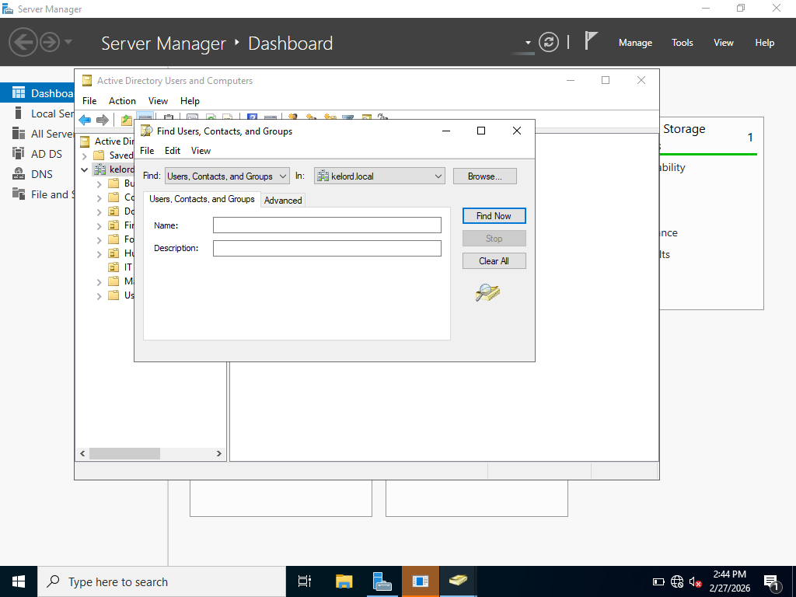
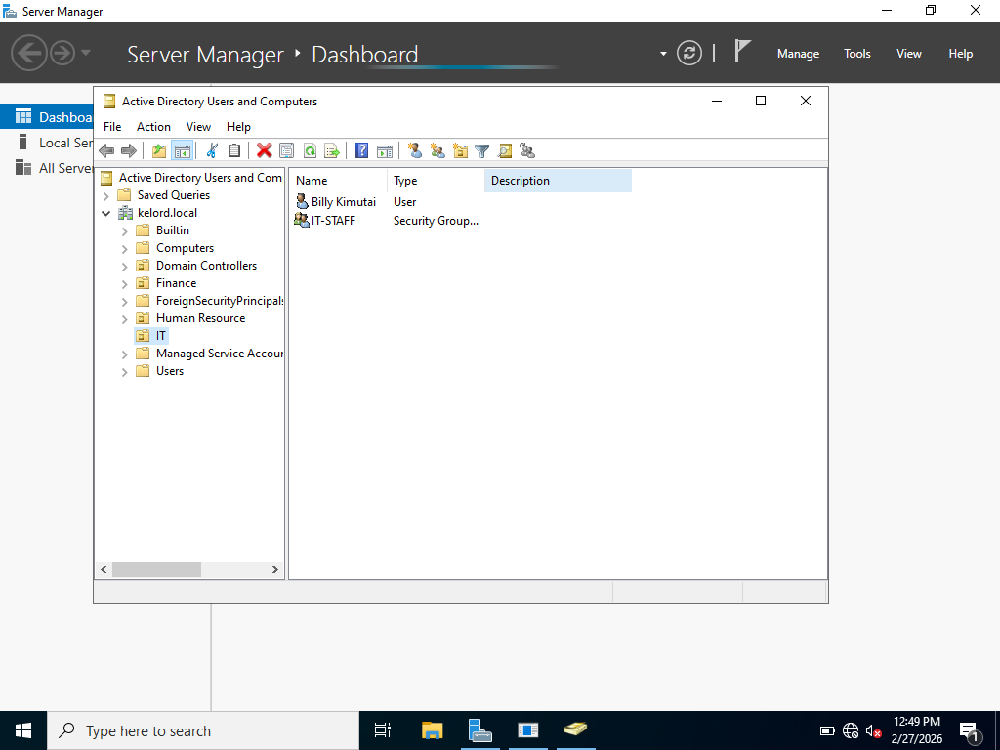

# Enterprise IT Support Lab Simulation

## Objective
Simulate an enterprise IT support environment to practice troubleshooting, Active Directory management, client support, and basic security tasks.

## Lab Environment
- **Server:** Windows Server 2022 (Domain Controller)  
- **Client:** Windows 11 VM  
- **Virtualization:** VirtualBox  
- **Host Machine:** 16GB RAM, 512GB SSD  

## Tasks Performed
- Installed and configured Active Directory Domain Services  
- Created Organizational Units (OUs) and security groups  
- Added, reset, and unlocked domain user accounts  
- Joined client machines to the domain  
- Installed Windows OS on client and performed disk imaging  
- Configured password policies and account lockout policies  
- Set up shared folders with permissions  
- Simulated network issues and performed troubleshooting  

## Troubleshooting Scenarios
- Resolved login issues for domain users  
- Fixed DNS misconfiguration  
- Tested group-based access control  
- Recovered user data before OS reinstallation  

## Skills Demonstrated
- IT Support: password resets, user account management, client troubleshooting  
- Sysadmin basics: AD user/groups, domain joining, policy management  
- Monitoring & NOC basics: checking logs, service status, connectivity  
- Cybersecurity fundamentals: least-privilege access, password policy, account lockout  

## Key Lessons Learned
- Hands-on experience managing domain users and client machines  
- Understanding common IT support challenges in enterprise environments  
- Practiced structured troubleshooting and problem resolution
- Built confidence for IT support and junior sysadmin interviews

## Screenshots
Place your screenshots in `screenshots/` folder and reference here, e.g.:

-   
-   
-   
-   

